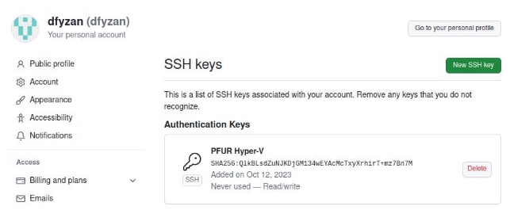
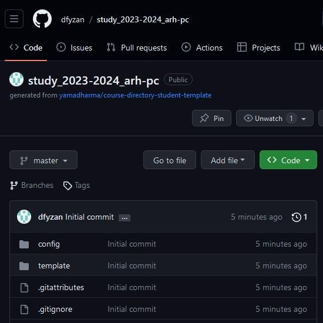
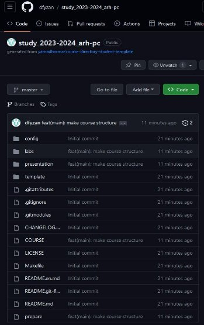
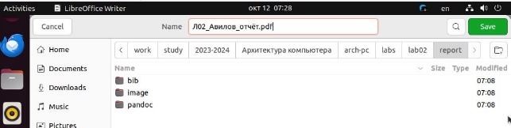

**РОССИЙСКИЙ УНИВЕРСИТЕТ ДРУЖБЫ НАРОДОВ**

**Факультет физико-математических и естественных наук Кафедра прикладной информатики и теории вероятностей**

**ОТЧЕТ**  

**ПО ЛАБОРАТОРНОЙ РАБОТЕ № 2**

Студент: Авилов Иван Олегович         Группа: НБИбд-01-23         

**МОСКВА** 2023 г.

**Цель работы:** изучить идеологию и применение средств контроля версий. Приобрести практические навыки по работе с системой git.

**Порядок выполнения работы:**  

1. Выполняем базовую настройку git: указываем имя, фамилию и почту владельца репозитория, настраиваем некоторые параметры.

2. Создаём SSH ключ и указываем его на сайте github.

3. Создаём репозиторий курса на основе шаблона и клонируем на рабочий ПК.

4. Выполняем настройку каталога курса.

5. Проверяем правильность создания иерархии рабочего пространства.

Всё выполнено правильно

**Задания для самостоятельной работы:**

1. Создаём отчёт по выполнению данной лабораторной работы в соответствующем каталоге.
1. Копируем отчёт по выполнению предыдущей лабораторной работы в соответствующий каталог.

3. Загружаем файлы на github.

**Вывод:**  

В ходе выполнения данной лабораторной работы я изучил применение средств контроля версий и приобрёл практические навыки по работе с системой git.
